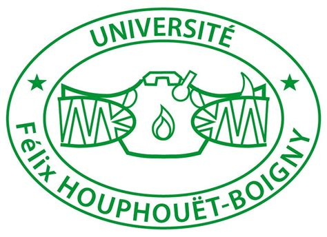
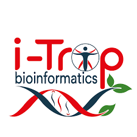
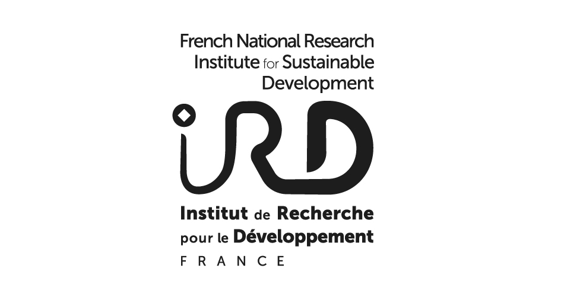
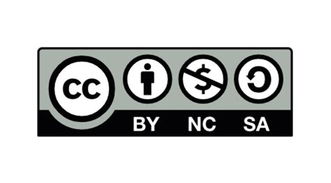

 

 

# Welcome to the GitHub repository of **CIBiG**

The **International Certificate in Bioinformatics and Genomics (CIBiG)** offers an intensive training program aimed at PhD students and researchers who work with sequencing technologies and genomic data. Over one month, participants gain comprehensive insights into sequencing, genomics and bioinformatics, learning to analyse data with stateoftheart methods, with applications in agriculture and health.

| Session  | Dates                                                          | Location                                                                                                                 | Seats | Status                                       |
| -------- | -------------------------------------------------------------- | ------------------------------------------------------------------------------------------------------------------------ | ----- | -------------------------------------------- |
| **2024** | 9 Sep - 4 Oct 2024                                             | [WAVE Regional Center of Excellence](https://wave-center.org/), Université Félix Houphouët-Boigny, Bingerville (Abidjan) | 15    | **Completed**                                |
| **2025** | **17 Nov - 12 Dec 2025**   (online intro: 3-14 Nov 2025) | Same as above                                                                                                            | 15    | **Completed** |

[Full details on the CIBiG website](https://wave-centre.github.io/cibig/)

 

 

### License

All resource material is licensed under the Creative Commons Attribution 4.0 International License. To view a copy of this license, visit http://creativecommons.org/licenses/by-nc-sa/4.0/

