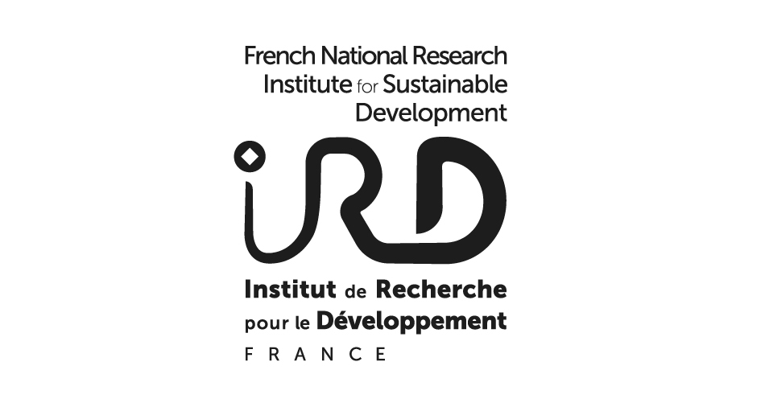

 

 

# Welcome on the github repository of the CIBIG

The CIBiG  offers an intensive training aimed at PhD students and researchers who use sequencing technologies and data in their research. This one-month training  provides comprehensive insights into sequencing, genomics and bioinformatics, and will teach participants how to effectively use bioinformatics methods to analyse sequencing data, with a focus on applications in agriculture and health.

| Date | Location | Trainees | Status | 
|---------|---------|---------|---------|
| 9 September - 4 October 2024 | The <a href="https://wave-center.org/" target_blank>WAVE Regional Center of Excellence</a>, Université Felix Houphouët Boigny, Bingerville, Abijan | 15 participants | Application opened |

[More information on the CIBIG web site](https://cibig-course.github.io/)

 

 

### License

The resource material is licensed under the Creative Commons Attribution 4.0 International License. To view a copy of this license, visit http://creativecommons.org/licenses/by-nc-sa/4.0/

