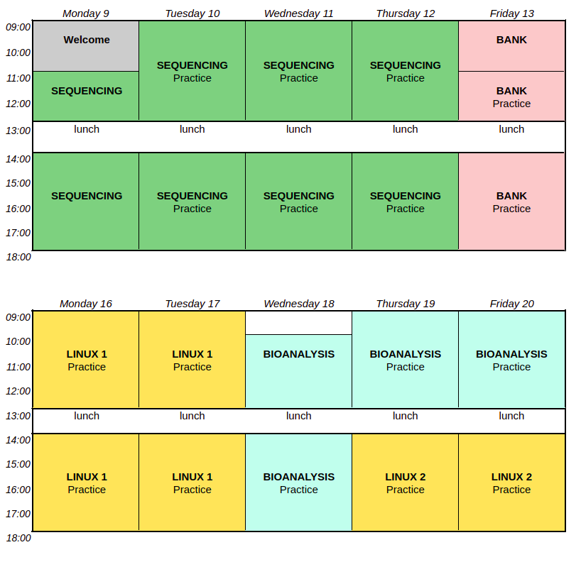
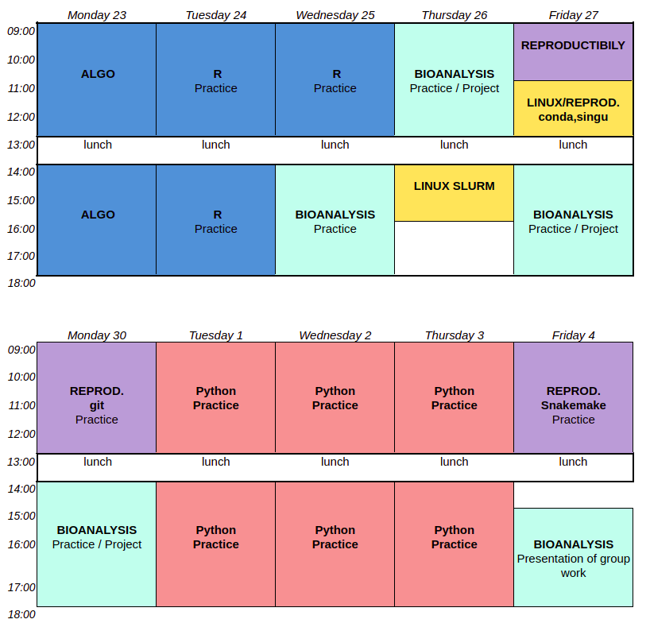

The CIBiG' team is happy to welcome its first cohort, from September 9 to October 4, 2024.
The training will take place at WAVE, located at the Pôle Scientifique et d'Innovation of University Félix Houphouët-Boigny (Bingerville).

### Language

The course will be in French, but the slides and other course material will be in English.

### Timetable

The timetables are not final and may be subject to changes. Please check regularly for updates.

### Program structure

| Code | Course name | Main Teachers | Helpers |
|----------------------------------------------------|----------------------------------------------------|----------------|----|
| ONLINE | Course review                                     | R. Nanema, F. Tiendrebeogo, F. Sabot |
|  SEQUENCING  | Sequencing: from library preparation to sequencing (30h) | M. Bangratz, M. Couderc | Roger |
| BANK  | Biological database                               | A. Dereeper, E. Tibiri | |
| LINUX1      | Linux Level 1  |   E. Tibiri, C. Tranchant | M. Couderc, A. Dereeper |
| LINUX 2    |  Linux Level 2                                          | E. Tibiri, C. Tranchant | M. Couderc, A. Dereeper |
| LINUX - slurm | Linux - slurm                                 | N. Tando, S. Anoman | ... |
| ALGO         | Introduction to Algorithmics                       | J. Orjuela, C. Tranchant | S. Cunnac |
| R              | Data analysis and visualization in R              | S. Cunnac, J. Orjuela | E. Tibiri |
| BIOANALYSIS  | OMICs data analysis                              | | |
| PYTHON   | Python programming                                | J. orjuela, S.Ravel | E. Tibiri, C. Tranchant |                       
| REPROD.  | Science reproductibility                         |  J. Orjuela, S. Ravel, E. Tibiri, C. Tranchant| |

[more detail about each course](https://cibig-wave.github.io/01-description.html)
