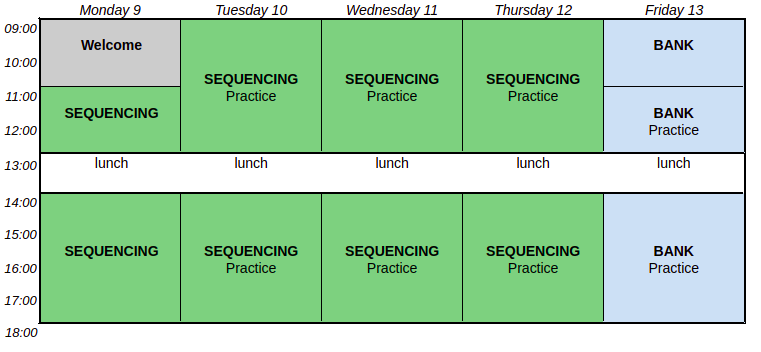
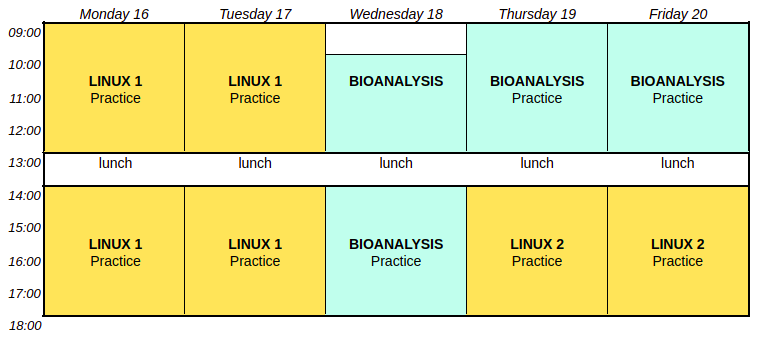
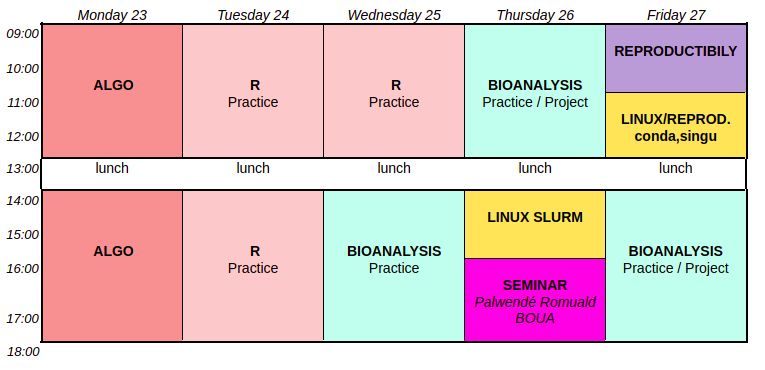
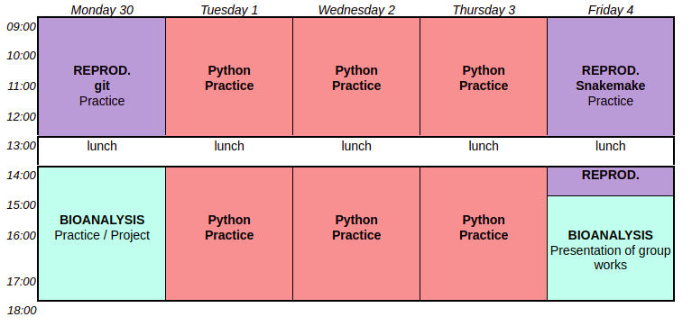

The CIBiG' team is happy to welcome its first cohort, from September 3 to October 4, 2024.
The training will take place at WAVE, located at the Pôle Scientifique et d'Innovation of University Félix Houphouët-Boigny (Bingerville).

### Language

The course will be in French, but the slides and other course material will be in English.

### Online learning classes 

##### introductory courses (12h), "September 3 and 4, 2024."

* Tuesday  - 9:00 am - 5:15 pm  

| Time | Course name | Teachers | 
|------|----------------------------------------------------|----------------|
| 9:00- 10:30 am |  General biology reminders on microorganisms (bacteria, viruses, etc.) |  Prof. Fidèle Tiendrebeogo |
|  | 10 min break |  |
| 10:45 am - 12:15 pm |  General biology reminders on eukaryotes | Prof. Romaric Nanema | 
|  | LUNCH |  |
| 2:00 - 3:30 pm| Structure and variations of genomes | Prof. François Sabot |
|  | 10 min break |  |
| 3:45 - 5:15 pm | NGS sequencing methods. | Prof. François Sabot |
| | Practical exercise | |

* Wednesday - 9:00 am - 5:15 pm  

| Time | Course name | Teachers | 
|------|----------------------------------------------------|----------------|
| 9:00 - 10:30 am |  Discussion on the evening exercise and feedback/questions about the previous day's lessons |  Prof. Fidèle Tiendrebeogo, Prof. Romaric Nanema and Prof. François Sabot |
|  | 10 min break |  |
| 10:45 am - 12:15 pm |  Applications of NGS technologies | Prof. François Sabot  | 
|  | LUNCH |  |
| 2:00 - 3:30 pm| Mendelian genetics | Prof. Romaric Nanema |
|  | 10 min break |  |
| 3:45 - 5:15 pm | General discussion over the two days, reflections on the results observed | Prof. Fidèle Tiendrebeogo, Prof. Romaric Nanema and Prof. François Sabot |
| | Practical exercise | |

The timetables are not final and may be subject to changes. Please check regularly for updates.

### Face to face classes

##### 154h, "September 9-October 4, 2024"

##### Timetable

#### Program structure

| Code | Course name | Main Teachers | Helpers |
|----------------------------------------------------|----------------------------------------------------|----------------|----|
| ONLINE | Course review                                     | R. Nanema, F. Tiendrebeogo, F. Sabot |
| SEQUENCING  | Sequencing: from library preparation to sequencing (30h) | M. Bangratz, M. Couderc |  |
| BANK  | Biological database                               | A. Dereeper, E. Tibiri | C. Tranchant |
| LINUX1      | Linux Level 1  |   E. Tibiri, C. Tranchant | M. Couderc, A. Dereeper |
| LINUX 2    |  Linux Level 2                                          | E. Tibiri, C. Tranchant | M. Couderc, A. Dereeper |
| BIOANALYSIS  | Practice                             | A. Dereeper, J. Orjuela, C. Tranchant, E. Tibiri | |
| BIOANALYSIS  | Group project                             |  A. Dereeper, J. Orjuela, C. Tranchant, E. Tibiri, R. Boua,, S. Cunnac, S. Ravel, R. Nanema, F. Tiendrebeogo | 
| ALGO         | Introduction to Algorithmics                       | J. Orjuela, C. Tranchant | S. Cunnac |
| R              | Data analysis and visualization in R              | S. Cunnac, J. Orjuela | E. Tibiri |
| LINUX - slurm | Linux - slurm                                 | N. Tando, S. Anoman | J. Orjuela|
| PYTHON   | Python programming                                | J. Orjuela, S.Ravel | E. Tibiri, C. Tranchant |   
| REPROD -overview | Science reproductibility - overview                       |  E. Tibiri | J. Orjuela, C. Tranchant   |
| REPROD - conda  | Science reproductibility  - conda, singularity                       |   N. Tando, S. Anoman, Julie Orjuela, S. Ravel | E. Tibiri |
| REPROD - git  | Science reproductibility  - git                       |  J. Orjuela, C. Tranchant| S. Ravel, E. Tibiri |
| REPROD - snakemake  | Science reproductibility  - snakemake                        | S. Ravel, J. Orjuela | E. Tibiri, C. Tranchant |

[more detail about each course](https://cibig-wave.github.io/01-description.html)
