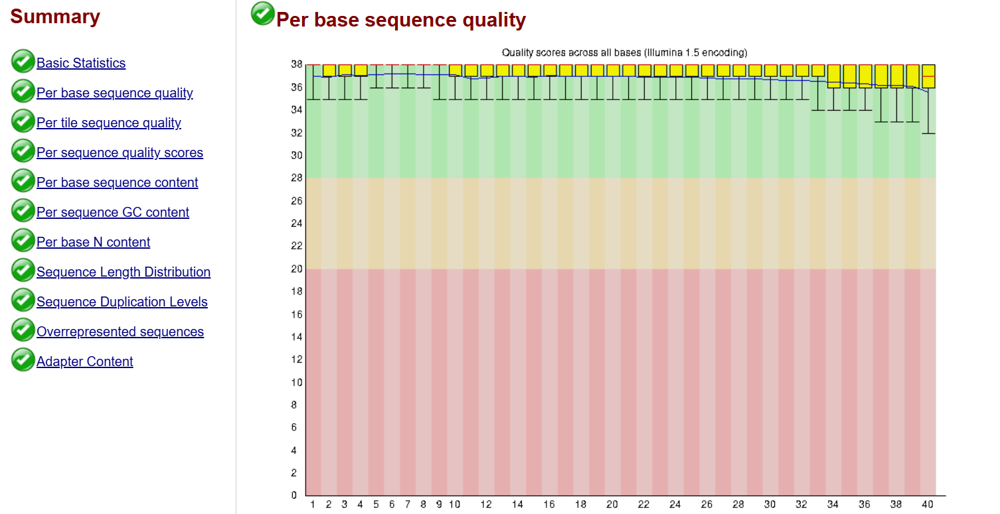
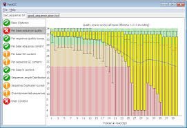

# OMICS training: From sequencing raw reads to SNP analysis

Created by C. Tranchant (DIADE-IRD), J. Orjuela (DIADE-IRD), F. Sabot (DIADE-IRD) and A. Dereeper (PHIM-IRD)

***

# <span>Table of contents</span>
<a class="anchor" id="home"></a>

[I- Data retrieval: Getting datasets](#data)

[II- Quality control: checking the reads quality](#quality) 

[III- Mapping: How to map reads against a reference genome ?](#mapping) 

   * [1. Reference indexation](#refindex)
   * [2. Run the mapping with `bwa mem`](#bwamem2-cmd)
   * [3. Convert sam into bam `samtools view`](#samtoolsview)
   * [4. Calculate stats from mapping `samtools flagstat`](#flagstats)
   * [5. Generate a bam file that contains only the reads correctly paired mapped `samtools view`](#corrmap)
   * [6. Indexing bam file](#indexbam) 
   * [7. Visualize mapping with Tablet and/or IGV](#tablet) 

[IV- Mapping ON ALL SAMPLES](#loop) with `bcftools`

[V- SNP Calling](#snp_calling)

   * [1. Index reference with `samtools faidx`](#indexref)
   * [2. Generate a bcf file (BCF format) using `bcftools mpileup`](#mpileup)
   * [3. Perform SNP calling using `bcftools call`](#call)
   * [4. Perform a complete SNP calling on all individuals using a bash script](#snp_calling)
   * [5. Index your VCF file with `tabix`](#vcf_index)

[VI- SNP analysis](#snp_analysis)

   * [1. Some statistics about SNPs with `bcftools`](#snp_stats)
   * [2. SNP frequency and density using `vcftools`](#snp_freq)
   * [3. Annotate SNPs using `snpEff`](#snpeff)
   * [4. PCA of samples using `plink`](#plink)
   * [5. Compare populations using FST `vcftools`](#fst)


***


# <span> I- Data retrieval: Getting datasets <a class="anchor" id="data"></a></span>  

To analyze sequencing data, we usually use a lot of bioinformatics softwares generating a lot of data. It's very important to manage and organize your data. 

Firstly, we are going to download data we use in this training.

#### <span> Download sequencing data and the reference genome <a class="anchor" id="download"></a> - `wget` </span>  

Data are available at the following URL : [https://itrop.ird.fr/CIBIG2024/variants_trainings/SV_DATA.tar.gz](https://itrop.ird.fr/CIBIG2024/variants_trainings/SV_DATA.tar.gz)

Uncompress the gzipped archive.

#### <span> Check the content of the directory SV_DATA</span>  - `ls`

#### <span> List the content of your home directory and check that the directory SV_DATA have been created</span>  - `ls` 

#### <span> List the content of the directory SV_DATA</span>  - `ls`

#### <span> List the content of the directory REF</span>  - `ls`

#### <span> Download the reference genome from NCBI

Using either `datasets` command from NCBI, or from NCBI web site [https://www.ncbi.nlm.nih.gov/datasets/genome/](https://www.ncbi.nlm.nih.gov/datasets/genome/), search for reference genome of : Bathycoccus prasinos

Download reference genome

What are the formats of the files present in this directory ? What do you think these file contains?
<br>
How many chromosomes does the reference file contain? `grep`


#### <span> Go into the directory SV_DATA/SHORT_READS and list the content of this directory - `cd` `ls`</span>  

How many files does it contain ? What is the format ?

# <span> II- Quality Control of RNA-seq / DNA-seq Data with **FastQC** and **MultiQC** <a class="anchor" id="quality"></a></span>  

## Introduction

Quality control (QC) is an essential step in the analysis of NGS data.\
Two tools are commonly used:

-   **FastQC** --- individual analysis of FASTQ files
-   **MultiQC** --- aggregation and visualization of multiple QC reports
    (FastQC, alignment, quantification, etc.)

This tutorial covers:

✔ Fastq files checking\
✔ Essential commands\
✔ How to interpret QC metrics\
✔ Concrete examples\
✔ Simulated "screenshots" of FastQC and MultiQC

------------------------------------------------------------------------

## 1. Fastq files checking

#### <span> Go into the directory SV_DATA/SHORT_READS and list the content of this directory - `cd` `ls`</span>  

How many files does it contain ? What is the format ?


#### <span> List the 10 first lines of one file</span>  - `head` `zcat` `wc`

How many sequences are there in the first fastq file?

#### <span> Go into your working directory and create the directory 1-FASTQC</span>  `mkdir`

------------------------------------------------------------------------

## 2. Running FastQC

### Quick version check

``` bash
fastqc --version
multiqc --version
```

### Display options for fastqc

``` bash
fastqc --help
```


### Here are examples of command for running fastqc

On a single FASTQ file

``` bash
fastqc sample_01.fastq.gz
```
 
On multiple files at once

``` bash
fastqc *.fastq.gz -o fastqc_results/
```

### Run fastqc on all raw fastq files

------------------------------------------------------------------------

## 3. Example of FastQC Output

FastQC generates two files:

-   `sample_01_fastqc.html` → graphical report\
-   `sample_01_fastqc.zip` → raw QC metrics

Below are **simulated screenshots** of the main report sections.

------------------------------------------------------------------------

## Example: FastQC Summary (simulated)

    >> Basic Statistics            PASS
    >> Per base sequence quality   PASS
    >> Per sequence GC content     WARN
    >> Adapter Content             FAIL
    >> Overrepresented sequences   FAIL

------------------------------------------------------------------------

## Example: Per-base quality plot (simplified ASCII)

Example of good quality sample:

{: width="200px"}

Example of bad quality sample:

{: width="200px"}


------------------------------------------------------------------------

## Example: Adapter contamination (simulated)

    Adapter Content (%)
    100 |■■■■■■■■■■■■■■■■■■■■■■■■■■■■■■■■■■■■■■
     80 |
     60 |
     40 |■■■■■■■■■■■■
     20 |
      0 |-------------------------------------------------------
          0      20      40      60      80     100 (position)

------------------------------------------------------------------------

## 4. Inspecting and Extracting FastQC Data

To extract the ZIP file:

``` bash
unzip sample_01_fastqc.zip -d fastqc_extracted/
```

Useful data is in:

    fastqc_extracted/fastqc_data.txt

------------------------------------------------------------------------

## 5. MultiQC: Aggregating All Reports

### Basic command in a folder containing multiple FastQC reports

``` bash
multiqc fastqc_results/ -o multiqc_report/
```


### <span> Run `MultiQC`</span>  

* go into the directory 1-FASTQC
* run MultiQC into this directory

------------------------------------------------------------------------

## Example: MultiQC Summary (simulated)

    ==================== MultiQC Report ====================

    FastQC
    --------------------------------------------------------
    Samples processed : 12
    PASS : 8
    WARN : 2
    FAIL : 2

    Worst modules:
     - Adapter Content (2 FAIL)
     - Per base sequence quality (1 WARN)
     - GC Content (1 WARN)

------------------------------------------------------------------------

## Example: MultiQC Table (simulated)

    Sample       | Reads (M) | %GC | Q30 (%) | Adapter Fail
    --------------------------------------------------------
    sample_01    |   25.1    | 48  |   92     |    YES
    sample_02    |   26.3    | 49  |   94     |    NO
    sample_03    |   21.9    | 47  |   93     |    NO

------------------------------------------------------------------------

## 6. Interpretation of Key FastQC Modules

    ----------------------------------------------------------------------
    Module              What to check               Common issues
    ------------------- --------------------------- ----------------------
    Per base            Boxplots across read        Decrease at read ends,
    quality             positions                   degraded sequencing

    GC content          Curve vs theoretical        Contamination, 
                        distribution                GC biases               

    Adapter content     Adapter levels across       Need for adapter 
                        positions                   trimming               

    Overrepresented     Repeated sequences          rRNA, adapters, PCR
    sequences                                       contamination
    ---------------------------------------------------------------------

------------------------------------------------------------------------

## 7. Follow-up: Adapter Trimming (optional)

Example using **Trimmomatic**:

``` bash
trimmomatic PE -threads 8   sample_01_R1.fastq.gz sample_01_R2.fastq.gz   sample_01_R1_trimmed.fastq.gz sample_01_R1_unpaired.fastq.gz   sample_01_R2_trimmed.fastq.gz sample_01_R2_unpaired.fastq.gz   ILLUMINACLIP:TruSeq3-PE.fa:2:30:10   LEADING:3 TRAILING:3 SLIDINGWINDOW:4:15 MINLEN:36
```

This will perform the following:

* Remove adapters (ILLUMINACLIP:TruSeq3-PE.fa:2:30:10)
* Remove leading low quality or N bases (below quality 3) (LEADING:3)
* Remove trailing low quality or N bases (below quality 3) (TRAILING:3)
* Scan the read with a 4-base wide sliding window, cutting when the average quality per base drops below 15 (SLIDINGWINDOW:4:15)
* Drop reads below 36 bases long (MINLEN:36)

Then rerun QC:

``` bash
fastqc trimmed/*.fastq.gz
multiqc .
```

------------------------------------------------------------------------

## 8. Take-home messages

With FastQC and MultiQC you can:

-   quickly assess raw FASTQ quality\
-   detect adapter contamination\
-   identify GC biases\
-   visualize QC for all samples simultaneously


# <span> III- Mapping: How to map reads against a reference genome ? <a class="anchor" id="mapping"></a></span>  

In this practice, we are going to map short reads against a reference. We will use reference.fasta as reference genome and ILLUMINA READS from your favorite CLONE.

2 steps are required : 
- **Reference indexing**: `bwa index reference`
- **Mapping in itself**: `bwa mem  -R READGROUP [options] reference fastq1 fastq2 > out.sam`


## <span> 1. Reference indexation  <a class="anchor" id="refindex"></a></span>  

Before mapping we need to index reference file! Check bwa-mem2 index command line. 

* Go into the directory REF
* Index the reference with reference.fasta

``` bash
bwa-mem2 index reference.fasta
```

#### <span>Check that the indexes have been created </span>  


## <span> 2. Run the mapping with `bwa mem2` <a class="anchor" id="bwamem2-cmd"></a></span>  

Let's map now but only WITH READS FROM ONE SAMPLE </span>  

#### <span> Create the `2-MAPPING` directory that will contain files generated by bwa-mem2</span> 

Go into the directory 2-MAPPING

#### Display options for bwa-mem2 mem

``` bash
bwa-mem2 mem -help
```

#### Run the mapping for one sample

#### <span>Check that the file `.sam` have been well created by `bwa-mem2 mem` </span>  

#### <span>Display the first and the end of the newly created SAM file  </span>  

## <span> 3. Convert sam into bam `samtools view` <a class="anchor" id="samtoolsview"></a></span>  

#### Check that the bam file has been created 

* Have a look at the filesize of the sam and bam files.
* Remove the sam file 

## <span> 4. Calculate stats from mapping `samtools flagstat`<a class="anchor" id="flagstats"></a></span>  

#### <span> Display the content of the flagstat file</span> 

#### Redirect the output of flagstat in a specific file with .flagstat extension

## <span> 5. Generate a bam file that contains only the reads correctly paired mapped `samtools view`<a class="anchor" id="corrmap"></a></span>   

[https://broadinstitute.github.io/picard/explain-flags.html](https://broadinstitute.github.io/picard/explain-flags.html)


## <span> 6. Sort and index the final bam file<a class="anchor" id="indexbam"></a></span>  

#### Sort bam file by position on reference `samtools sort`

* Check that the new bam file have been created
* Remove the bam file previously created (A1.f2.paired.bam)

#### Create the index of the bam file just created `samtools index`

* Check that the index file has been created

## <span> 7. Visualize mapping with Tablet and/or IGV<a class="anchor" id="tablet"></a></span>  

#### Install and launch Tablet or IGV viewer

#### Transfer reference fasta file, bam file and index from the server to your computer `scp`

#### Load reference file and bam file

# <span> IV- Mapping on all samples <a class="anchor" id="loop"></a></span>  


As a first step, write a bash script called `mapping1.sh` that allows to automatize the complete analysis for one sample

``` bash
cd ~/2-MAPPING

bwa-mem2 mem ...
samtools ...
```

Second, write a bash script called `mapping_all.sh` that allows to map data from all samples using a loop 

``` bash

for fastq in `ls ...`
do 

done;
```

This script must take a directory containing all fastq files as input

First, try to launch only with 2 individuals. When the analysis is OK for 2, extent to all individuals.

#### Launch the complete analysis in a cluster mode using `sbatch` SLURM command

# <span> V- SNP Calling <a class="anchor" id="snp_calling"></a></span> 
 
We test SNP calling protocol only with two samples before running on all samples !

#### <span> Create the directory `3-SNP` into your work directory </span> 

Go to this new directory `3-SNP`

## <span> 1. Index reference with `samtools faidx`  <a class="anchor" id="indexref"></a></span>  

``` bash
samtools faidx --help
```

Check you obtained new indexed files

## <span> 2. Generate a bcf file (BCF format) using `bcftools mpileup`  <a class="anchor" id="mpileup"></a></span>  

List all the bam files

Display options of bcftools mpileup 

``` bash
bcftools mpileup --help
```

Generate first a bcf file for 2 samples

## <span> 3. Perform SNP calling using `bcftools call`  <a class="anchor" id="call"></a></span>

Display options of bcftools call 

``` bash
bcftools call --help
```

First, generate a vcf file from the bcffile for the 2 samples

Look at the first 50 lines of the VCF file

Look at the last lines of the VCF file

## <span> 4. Perform a complete SNP calling on all individuals using a bash script <a class="anchor" id="snp_calling"></a></span>

#### <span>Use a `for loop` in a bash script for giving all infidivudals and generate the final VCF file</span> 

### <span>Have a Look to the VCF created - `head` `tail` </span> 

How many variants is contained in the VCF file?

## <span> 5. Index your VCF file with `tabix` <a class="anchor" id="vcf_index"></a></span>

Using bgzip and tabix, compress your VCF file and index it

# <span> VI- SNP analysis <a class="anchor" id="snp_analysis"></a></span> 

## <span> 1. Some statistics about SNPs with `bcftools`<a class="anchor" id="snp_stats"></a></span> 

Count the number of variants with `bcftools stat`
- Run the bcftools stats on the vcf file and save the result into the file `SNP_statistics.txt`
- How many samples were used for this SNP analysis ?
- How many SNPs were detected ? Is there any other easy way to identify the number of variants in VCF file?
- What is the ratio transition/transversion?

## <span> 2. SNP frequency and density using `vcftools`<a class="anchor" id="snp_freq"></a></span>

### <span>Calculate allele frequency of each position - `vcftools` </span> 

Calculate allele frequency of each position using `vcftools`

--freq2 : outputs the frequencies without information about the alleles

--freq would return their identity

--max-alleles 2 to exclude sites that have more than two alleles.

Compare outputs between these two options

### <span>Calculate SNP density along chromosome - `vcftools` </span> 

We will make use of `vcftools` to calculate the density of variants along the chromosome 1 of Japonica rice, in sliding windows. To do so, we will set a 100kb sliding window to the option `--SNPdensity`


### <span>Visualize SNP density using `circos` </span>

Be carefull, this version of Circos requires to be located in the circos directory

Install Circos and go in the Circos directory to run it

#### Install Circos in the terminal by typing these commands

``` bash
cd ~

git clone https://github.com/vigsterkr/circos.git

cd circos

./install-unix

conda create -n circos -c bioconda perl-config-general perl-gd perl-math-bezier perl-math-round perl-math-vecstat perl-params-validate perl-readonly perl-set-intspan
```

#### Generate input file for circos

With a simple bash command (`awk`), create the input data file for Circos for visualzation of line plot (space separated format: chr start end value). The file must be named `density.tyxt`

Go to the Circos directory and download an example of circos configuration file available at https://sniplay.southgreen.fr/examples/circos1.conf

#### Create a karyotype file indicating the lengths and names of chromosomes

Try to guess the length of the chromosome1 to indicate in the karyotype file. For instance by using the `tail` command on `density.txt` file

Write into a karyotype file called `karyotype.txt`, the size and color of the chromosome 1.

```bash
cd /home/jovyan/rice3k
echo "chr - 1 1 0 43200000 black" >karyotype.txt
```

##### Edit the Circos configuration file to adapt the data file names. And run Circos as follows:

Activate the conda environnement for Circos before running circos

```bash
cd ~/circos
conda activate circos
bin/circos --conf circos1.conf
conda deactivate
```

Look at the SNP density on Circos image output

 

## <span> 3. Annotate SNPs using `snpEff`<a class="anchor" id="snpeff"></a></span>

## <span> 4. PCA of samples using `plink`<a class="anchor" id="plink"></a></span>

### <span>Generate PCA using genotyping information contained in VCF - `plink --cluster --pca` </span> 

`Plink` alllows to create a PCA (principal components analysis) of samples, so that we can easily evaluate genetic distance between samples. 

This will generate a matrix of coordinates in the different component. By default, it provides the first 20 principal components of the variance-standardized relationship matrix. We will focus only the first 3 axes for subsequent visualization (`--pca 3`)

## <span> 5. Compare populations using FST `vcftools`<a class="anchor" id="fst"></a></span>

FST is an index that reflect the level of differenciation between populations. We will calculate FST values for each variant in order to know if they can dissociate specific alleles of the two populations.

Using `grep` and `awk`, create two distinct file (called `pop1` and `pop2`) listing the names of accessions that are assigned to each group
